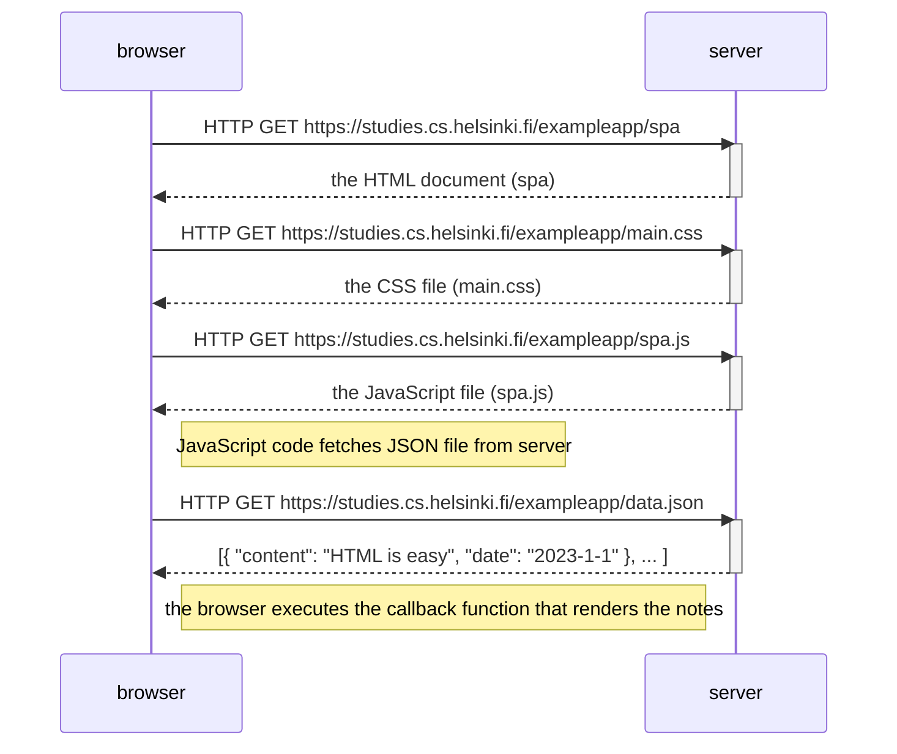

```mermaid

sequenceDiagram
participant browser
participant server

browser ->> server: HTTP GET https://studies.cs.helsinki.fi/exampleapp/spa
activate server
server -->> browser: the HTML document (spa)
deactivate server

browser ->> server: HTTP GET https://studies.cs.helsinki.fi/exampleapp/main.css
activate server
server -->> browser: the CSS file (main.css)
deactivate server

browser->>server: HTTP GET https://studies.cs.helsinki.fi/exampleapp/spa.js
activate server
server-->>browser: the JavaScript file (spa.js)
deactivate server

note right of browser: JavaScript code fetches JSON file from server

browser ->> server: HTTP GET https://studies.cs.helsinki.fi/exampleapp/data.json
activate server
server -->> browser: [{ "content": "HTML is easy", "date": "2023-1-1" }, ... ]
deactivate server
note right of browser: the browser executes the callback function that renders the notes
```